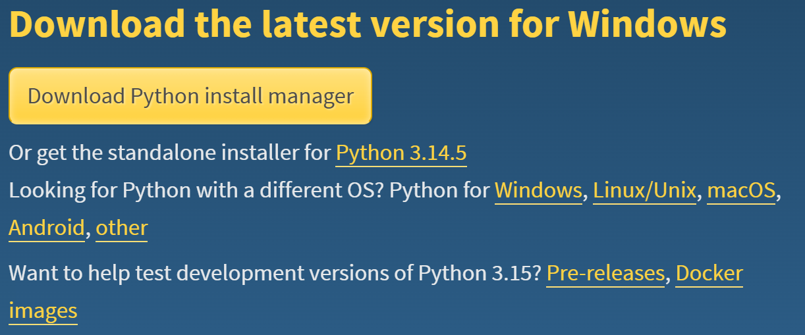
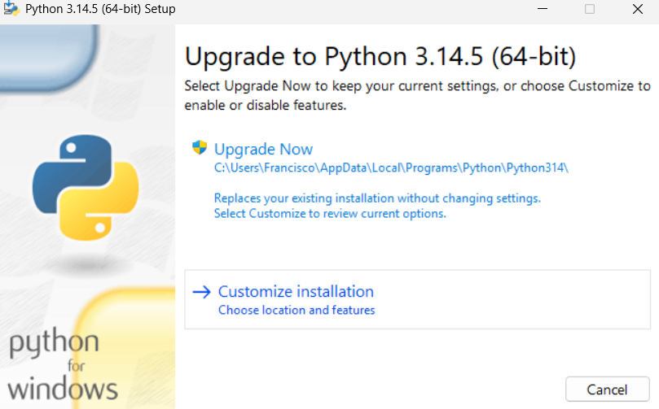

# Instalación y configuración
## Python
Descargar el programa para instalar. 

https://www.python.org/downloads/

Automáticamente detectará el sistema operativo que se tenga instalado, por ejemplo: 






### Versiones instaladas
```bash
py --list

PS C:\Users..> py --list                            
 -V:3.14 *        Python 3.14 (64-bit)
 -V:3.13          Python 3.13 (64-bit)
 -V:3.12          Python 3.12 (64-bit)
 -V:3.11          Python 3.11 (64-bit)
 -V:3.10          Python 3.10 (64-bit)
 -V:3.8           Python 3.8 (64-bit)
```

Si requieres hacer uso de alguna versión partícular, ejemplo: 
```bash
py -3.12 --version
...
Python 3.12.4
```

Si requieres hacer uso de la versión default: 
```bash
python --version
...
Python 3.14.5
```

### * Mac OS & Linux
Por default en Mac, ya se encuentra instalado python, sin embargo, se puede actualizar haciendo uso de la misma liga. 

Recuerde que en MacOS se teclea python3 en lugar de python 

Si requieres hacer uso de alguna versión partícular, ejemplo: 
```bash
python3 -3.12 --version
...
Python 3.12.3
```

## Entorno virtual
```bash
python -m venv venv
```

### Activar el entorno virtual – Windows
```bash
.\venv\Scripts\activate  
```


### Activar el ambiente virtual – MacOS:
```bash
source venv/bin/activate 
```

### Problemas de privilegios en windows 
Ejecutar windows power shell (como administrador) 

Ejecutar el siguiente comando : 
```bash
Set-ExecutionPolicy Unrestricted
```

### Actualización de pip
```bash
python -m pip install --upgrade pip
```

## Instalación de librerías
### django (versión 6)  
```bash
pip install django

# Verificación de versión 
python -m django --version

pip list
```
#### Opcional - extensión para VS


### Otras librerías
+ pylint - Comprobador de sintaxis
+ pillow – Manejo de Imágenes
+ django-ckeditor - Editor CKEDITOR – wysiwyg 

## Otras herramientas (opcional)
+ Sqlite Browser -> https://sqlitebrowser.org/ 
+ Github ->  https://github.com/
+ github desktop -> https://desktop.github.com/ 


