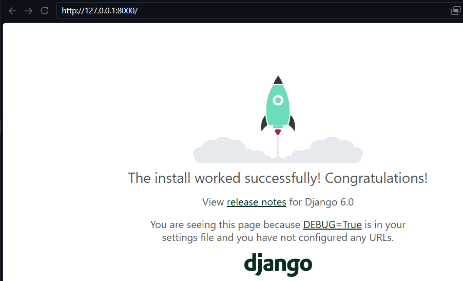
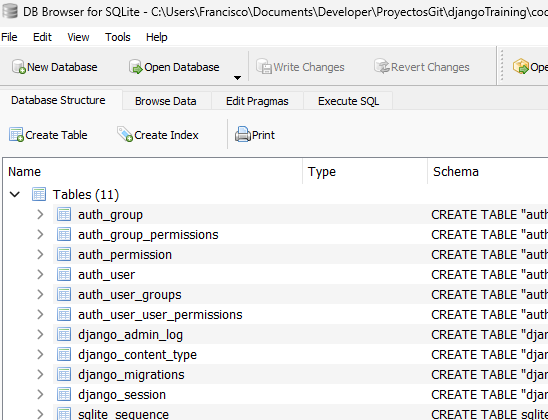
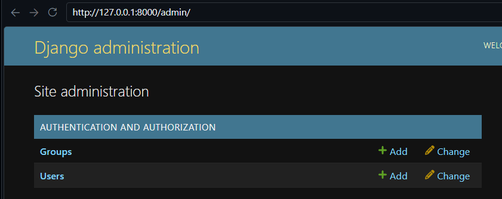

# Proyecto Webpersonal
## Startproject - Crear un proyecto

```bash 
# Sintaxis para crear un proyecto
django-admin startproject <Nombre_del_proyecto>

#Ejemplo
django-admin startproject webpersonal
```

## runserver - Iniciar el servidor web en el puerto 8000  (Default) 
Recuerda que debes estar dentro de la carpeta del proyecto (webpersonal)

```bash
python manage.py runserver
```



## runserver Iniciar servidor en otro puerto 
```bash
#Sintaxis
python manage.py runserver <ip / name> <Puerto>

# Ejemplo
python manage.py runserver 127.0.0.1:8080
```

## startapp - Crear una aplicación 
```bash
# Sintaxis 
python manage.py startapp <Nombre_de_la_aplicación> 
# Ejemplo
python manage.py startapp core 
```

## makemigrations & migrate - Migración a base de datos
```bash
# Sintaxis – Migrar TODAS las aplicaciones
python manage.py makemigrations
python manage.py migrate


# Sintaxis - Migrar solo una aplicación
python manage.py makemigrations <aplicación>
python manage.py migrate  <aplicación>

# Ejemplo: 
python manage.py makemigrations portfolio
python manage.py migrate portfolio 
```

### Opcional - Verificación de tablas creadas con SQLite


## Crear Super usuario
```bash
python manage.py createsuperuser

Username (leave blank to use 'francisco'): admin
Email address: 
Password: 
Password (again): 
This password is too common.
Bypass password validation and create user anyway? [y/N]: y
Superuser created successfully.
```

### admin - Verificar acceso
1. Levantar el servidor (runserver)
2. URL: http://127.0.0.1:8000/admin 



# settings.py - Configuración básica
Es un archivo de configuración, revisa las siguientes variables: 
```python
...
# Miestras estas en pruebas, es recomendable para visualizar los errores 
DEBUG = True

# Lenguaje y zona horaria
LANGUAGE_CODE = 'es'
TIME_ZONE = 'America/Mexico_City'

# Bases de datos
DATABASES = {
    'default': {
        'ENGINE': 'django.db.backends.sqlite3',
        'NAME': BASE_DIR / 'db.sqlite3',
    }
}

# Aplicaciones instaladas
INSTALLED_APPS = [
    'django.contrib.admin',
    'django.contrib.auth',
    'django.contrib.contenttypes',
    'django.contrib.sessions',
    'django.contrib.messages',
    'django.contrib.staticfiles',
]
# .. Sirven para el “Panel de administrador”, “autenticador” de usuarios, entre otras cosas.
```
