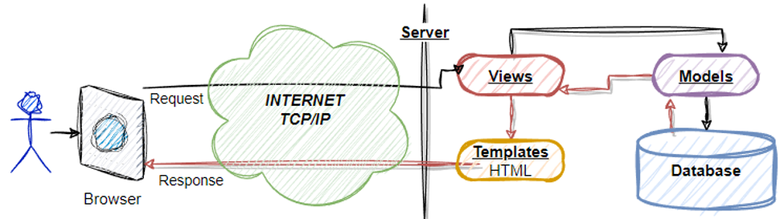
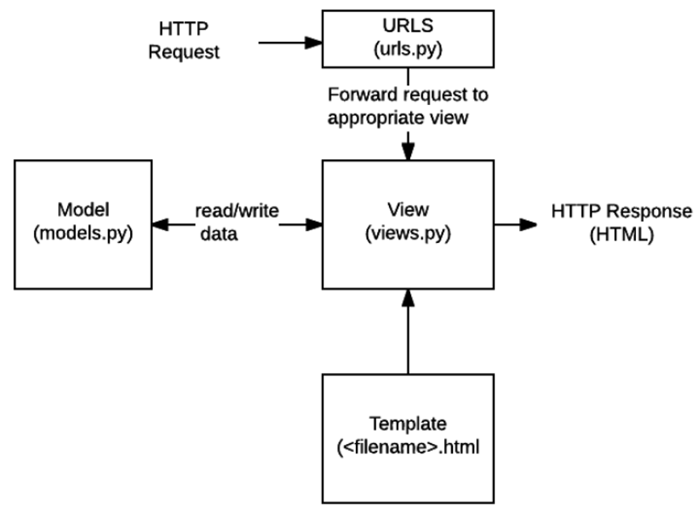

# FrameWork 
## ¿Por qué Django? 

+ Ahorro de tiempo
+ El desarrollador debe gastar tiempo enfocado a generar valor, mediante el entendiendo de la “lógica del negocio” y no con el desarrollo de CRUD’s para administración de catálogos, usuarios y privilegios o “inventando el hilo negro”
+ Framework para el desarrollo Web en Python 
+ Versátil / Fácil de usar
+ Aplicaciones complejas
+ Aplicaciones web eficientes y seguras 
+ *Django–rest Framework
    + Microservicios
    + Cómputo en la nube

El framework es <Modelo – Vista – Template> y se puede explicar mediante los siguientes diagramas. 





# Configuración de aplicación "core"
1. Agregar la aplicación “core” dentro del archivo settings.py en la sección correspondiente. 

```python
INSTALLED_APPS = [
    'django.contrib.admin',
    ... 
    'core', 
]
```

2. Editar el archivo core/views.py
```python
from django.shortcuts import render, HttpResponse

def home(request):
    return HttpResponse("<H1> Mi página </H1>" + 
                        "<H2> Aquí va la página </H2>")
```

3. Editar el archivo /webpersonal/urls.py 
```python
from core import views

urlpatterns = [
    path('admin/', admin.site.urls),
    path('', views.home, name='home'), 
]
```

4. Verificar en el servidor su funcionamiento


