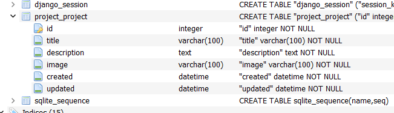
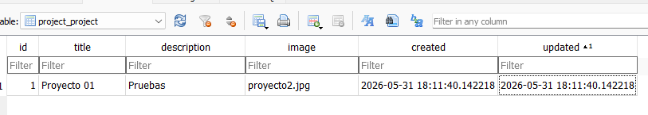

# ORM
Un ORM (Object-Relational Mapping o Mapeo Objeto-Relacional) es una técnica y herramienta de programación que permite conectar una base de datos relacional con un lenguaje de programación orientado a objetos. Actúa como un traductor para que puedas manipular datos usando clases y objetos en lugar de escribir código SQL.

## ¿Cómo funciona?
Un ORM realiza las siguientes equivalencias: 
+ Una tabla de la base de datos se convierte en una clase en tu código.
+ Una fila (o registro) se convierte en un objeto.
+ Una columna (o campo) se convierte en una propiedad/atributo de ese objeto.

## ¿Por qué se utiliza? (Ventajas)Abstracción
Puedes realizar operaciones CRUD (Crear, Leer, Actualizar, Borrar) sin necesidad de escribir comandos como INSERT INTO o SELECT * FROM. 

Todo se hace llamando a métodos estándar (por ejemplo: usuario.save()).

### Seguridad
Los ORMs manejan automáticamente las consultas preparadas, lo que ayuda a prevenir ataques de inyección SQL. 

### Independencia de base de datos
Facilitan el cambio de un motor de base de datos a otro (por ejemplo, de MySQL a PostgreSQL) sin tener que reescribir todas tus consultas.

### Migraciones
Muchos incluyen sistemas para gestionar el control de versiones de los cambios en la estructura de tu base de datos

## Django ORM  
Referencia:  https://docs.djangoproject.com/en/6.0/topics/db/queries/ 

Práctica
1.	Crear la aplicación proyecto
```bash 
python manage.py  startapp project 
```
2.	Agregar la aplicación en el archivo settings.py 
```python
...
    'django.contrib.staticfiles',
    'core', 
    'project',
]
```
###	Creación del MODELO
3. Dentro de la aplicación project, abrir el archivo “models.py”, crear la clase Project
```python
from django.db import models

class Project (models.Model):
    title = models.CharField(max_length=100)
    description = models.TextField()
    image = models.ImageField()
    created = models.DateTimeField(auto_now_add=True)
    updated = models.DateTimeField(auto_now=True)
```
Observa que cada atributo de la clase, representa una columna en la tabla que será creada.

4.	Realizar la migración a la base de datos. 
```bash
python manage.py makemigrations project
python manage.py migrate project
```
5. (Opcional)
Visualiza la estructura de la tabla creada en SQLite

6.	Registrar el modelo en el archivo admin.py de la aplicación proyecto
```python
from django.contrib import admin
from .models import Project

admin.site.register(Project)
```
6.	Para acceder al administrador de Django, solo hay que colocar la url: 

http://127.0.0.1:8000/admin/ 

7.	Agregar un registro, seleccione una imagen cualquiera, observe: 
    + Los nombres que aparecen, (object, title, ... en ingles)
    + La imagen no se muestra (marca un 404)
    + Observe donde se guardo el archivo de imagen (en el folder principal)
    + Verifique los campos de la base de datos y observe que la imagen no se guarda en la base de datos, lo que se guarda es un URL

