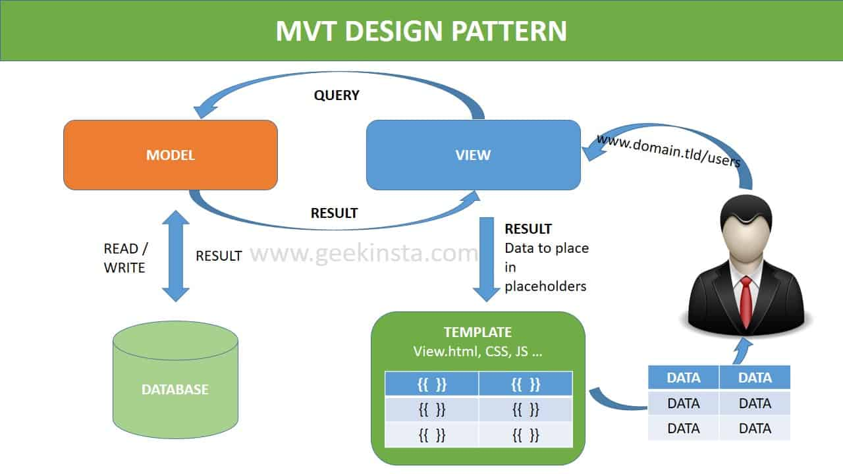
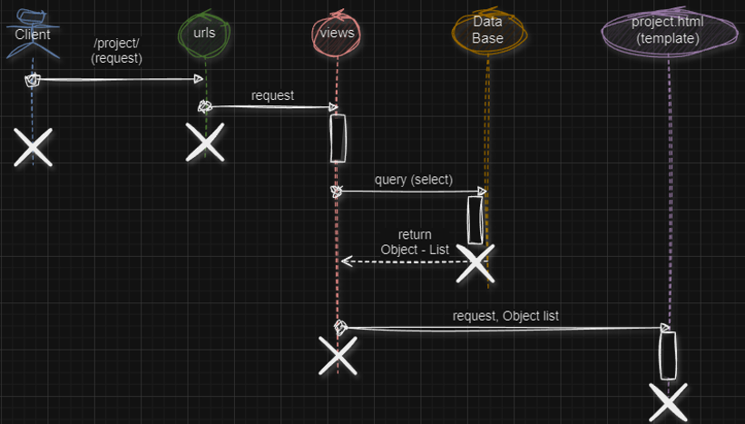
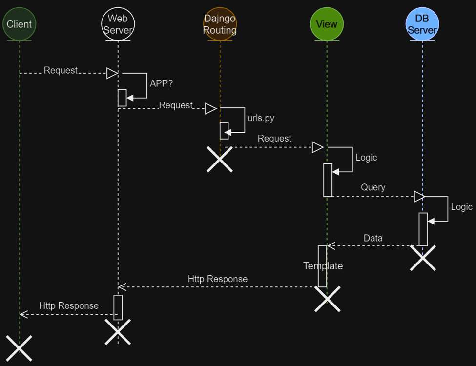

# Modelo Vista Template


## Práctica 1
1.	El diagrama de secuencia de lo que representa el ejercicio es:


2.	Crear la estructura de templates/project en la aplicación project. 
  + Crear el archivo project.html
3.	Del archivo portfolio.html (del template original), copiar el código correspondiente y pegarlo dentro de projects.html
  + Al igual que se hizo en el template home.html y contact.html, heredar del template base.html
  + Indicar el bloque de contenido  
  + Colocar el html correspondiente  
4. Identificar las partes dinámicas
  + Identifica el código que debe ser dinámica (deja solo un comentario)
  + Coloque la variable {{projects}}, detro del HTML, con el objetivo de visualizar lo que trae dicha variable
```python




  <!-- Contenido Principal -->
  <div class="margen_top">
    <h1 class="text-center">  
      <i class="fal fa-lightbulb-on"></i>    
      Nuestros Proyectos 
      <i class="far fa-hands-usd"></i>
    </h1>  
    {{projects}}      
          <!-- Proyecto -->
          <div class="row project">
            <div class="col-lg-3 col-md-4 offset-lg-1">
               " alt="" />
            </div>
            <div class="col-lg-7 col-md-8">
              <br>
              <h2 class="section-heading title">
                <! -- Titulo del proyecto -->
              </h2>
              <p>
                <! -- Descripción del proyecto -->
              </p>
              <p><a href="http://google.com">Más información</a></p>
            </div>
          </div>
          <!-- Otro Proyecto -->          
  </div>

```
5. Dentro del archivo views.py, consultar todos los proyectos y regresar el “querySet” en el template.
```python
from django.shortcuts import render
from .models import Project


def project(request):
    projects = Project.objects.all()
    return render(request, "project/project.html", {'projects': projects})
```
Observa que en el renderizado, ahora se devuelve el "contexto" mediante un mapa. 

6. En el archivo urls.py, agregar la ruta y vista correspondiente, observe que ya tiene dos archivos que se llaman views, por lo que es necesario renombrarlo. 

```python
...
from project import views as views_project

urlpatterns = [
    path('admin/', admin.site.urls),
    path('', views.home, name='home'),
    path('contact/', views.contact, name='contact'),
    path('project/', views_project.project, name='project'),
]
```
7. Modificar el “navbar” (menu) para que pueda acceder a los proyectos. (base.html)
```python
<a class="nav-link" href="">
```
8. Observa el resultado, debes de ver algo parecido a: 
```html
...
<QuerySet [<Project: Proyecto 2>, <Project: Proyecto 1>]>
...
```
Un QuerySet que es una lista de objetos, es la representación del resultado de una consulta a la base de datos, donde cada registro está representado por un objeto, recuerda que esta lista se obtuvo en el archivo views.py 

9. Meter en un ciclo los proyectos que recibirá el template. Para iterar dicha lista, lo hacemos con el template tag for 
```python
        
        <!-- Proyecto -->
        <div class="row project">
        <div class="col-lg-3 col-md-4 offset-lg-1">
            
        </div>
        <div class="col-lg-7 col-md-8">
            <br>
            <h2 class="section-heading title">
            {{project.title}}
            </h2>
            <p>
            {{project.description}}
            </p>
            <p><a href="http://google.com">Más información</a></p>
        </div>
        </div>
    
```
10. Verificar su funcionamiento
11. Corrección de links (active), archivo base.html
```python
<li class="nav-item">
    <a class="nav-link active " href="">
    <i class="far fa-user-secret"></i> Inicio</a>
</li>
... 
<li class="navbar-nav">            
    <a class="nav-link active" href="">
    <i class="far fa-file-chart-line"></i> Proyectos</a>
</li>          
<!-- Lo mismo para contact -->
```

### Explicación del flujo


1. El cliente realiza una solicitud HTTP (request) 
  + Puede ser un navegador web, app móvil, script, llamada AJAX etc. 
2. El servidor web, recibe la solicitud
  + El servidor web puede ser Apache, Nginx u otro junto con una interfaz de aplicación web como Gunicorn o uWSGI para servir aplicaciones Django	
3. Ruteo de URL (Django routing)
  + El servidor web pasa la solicitud a la aplicación Django basándose en la configuración del servidor.
  + Puede ser mediante un proxy o mediante el uso de servidores de aplicaciones como Gunicorn o uWSGI
4. Middleware de Django
  + Antes de llegar a la vista, el request pasa a través del middleware de Django
  + Se realizan tareas tales como: autenticación, compresión, manipulación de encabezados, etc. 
5.	Django determina qué vista debe manejar la solicitud
  + Archivo urls.py 
6. La vista realiza las operaciones correspondientes
  + Se puede conectar a la base de datos, mediante los modelos creados. 
  + Realiza cálculos
7. Generación de respuesta HTTP
  + La vista crea una respuesta HTTP utilizando un objeto HttpResponse
8. Middleware de salida
  + La respuesta pasa nuevamente por el middleware de Django, por si se requiere realizar alguna tarea adicional antes de regresar la respuesta
9. Envío de la respuesta al servidor web
  + Django envía la respuesta al servidor web o al servidor de aplicaciones, dependiendo la configuración
10.	Cliente recibe la respuesta
  + El cliente recibe la respuesta y la procesa
11.	Cierre de la conexión
  + La conexión entre el cliente y el servidor se cierra después de que se haya completado la transmisión de datos

## Práctica 2
Realizar un cambio al modelo de la app projects

1. En el archivo models.py 
  + Agregar el atributo link, ya que está creada la base de datos, dicho campo debe permitir valores nulos y/o vacíos. 
```python
image = ... 
link = models.URLField(null=True, blank=True, verbose_name='Liga')
created = ...
```
2. Realizar las migraciones en la base de datos
```bash
python manage.py makemigrations project
python manage.py migrate project
```
3. Actualiza el archivo project.html
```python

    <p><a href="{{project.link}}" target='_blank'>Más información</a></p>

```
