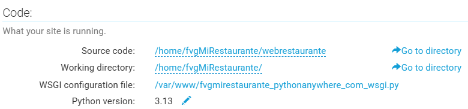
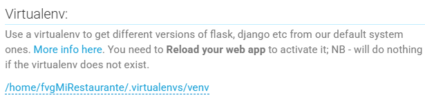
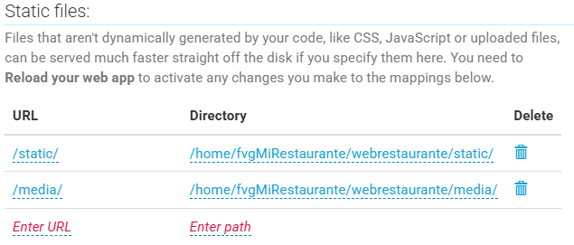

# Deploy app en pythonanywhere.com
1.	Crear una lista de los requerimientos
```bash
pip freeze > requirements.txt
```
2.	Comprimir la carpeta del proyecto "webrestaurante" 
3.	Crear una cuenta en Python anywhere  (Beginner acount) 
    + El username es como quedará el sitio, por ejemplo: fvgMiRestaurante
4. En "Files" subir el archivo .zip y también el archivo requirements.txt 
5. Abrir una consola "bash" 
    + El comando “pwd” permite visualizar la ruta donde se encuentra la terminal
    + El comando “ls -l” permite visualizar la lista de archivos que se encuentran
6. Crear un entorno virtual 
```bash
mkvirtualenv --python=python3 venv 
```
    + Para desactivar el entorno virtual "deactivate" 
7. Para activate el entorno virtual
```bash
source ~/.virtualenvs/venv/bin/activate
```
8. Descomprimir el archivo ZIP
```bash
unzip  webRestaurante.zip
```
9. Instalar las librerías. 
```bash
pip install –r requirements.txt

# Verificar que se encuentran las librerías
pip list
```
10.	Configuración de aplicación web. 
    + Dashboard -> Web -> Add a new web app 
    + No seleccionar ningún framework django, seleccionar “manual”  (Python 3.13) 
11. Configurar el directorio Source code

    

12. Configurar el Virtualenv

    

13.	Configurar archivo WSGI

https://help.pythonanywhere.com/pages/DeployExistingDjangoProject/

Buscar la línea # +++++++++++ DJANGO +++++++++++ 

```python
# +++++++++++ DJANGO +++++++++++
# To use your own django app use code like this:
import os
import sys
#
## assuming your django settings file is at '/home/fvgMiRestaurante/mysite/mysite/settings.py'
## and your manage.py is is at '/home/fvgMiRestaurante/mysite/manage.py'
path = '/home/fvgMiRestaurante/webrestaurante'
if path not in sys.path:
    sys.path.append(path)
#
os.environ['DJANGO_SETTINGS_MODULE'] = 'webrestaurante.settings'
#
## then:
from django.core.wsgi import get_wsgi_application
application = get_wsgi_application()
```

WSGI son las siglas de Web Server Gateway Interface. Es una especificación que describe cómo se comunica un servidor web con una aplicación web, y cómo se pueden llegar a encadenar diferentes aplicaciones web para procesar una solicitud/petición (o request).

14. Configurar la ruta static y media 



15. Configurar en el archivo settings.py

```python
ALLOWED_HOSTS = ['fvgMiRestaurante.pythonanywhere.com']
...
STATIC_URL = '/static/'
STATIC_ROOT = os.path.join(BASE_DIR, "static")

# Media files
MEDIA_URL = '/media/'
MEDIA_ROOT = os.path.join(BASE_DIR, "media")

```
16.	Collect static
```bash
python manage.py collectstatic 
```
17.	Verificar los warnings o errores antes del deploy
```bash
python manage.py check --deploy
```
18.	En la parte “Web” realizar un “Reload” 
19.	Verificar su funcionamiento
