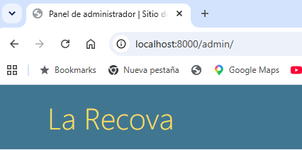
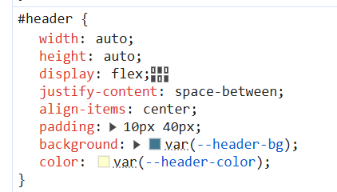
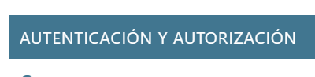
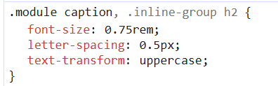
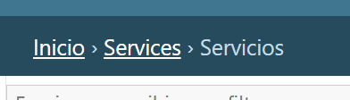
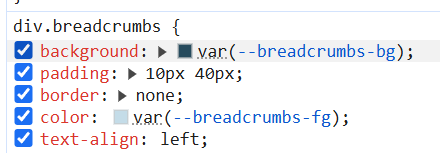
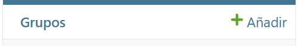
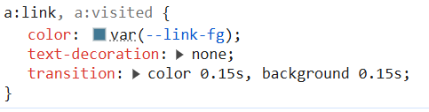

1. Navegar por el archivo base.html y base_site.html del entorno virtual, ejemplo de ruta: 
C:\Users\Francisco\Documents\Developer\Git\clases\Anahuac\DAW0822\Practicas\Django\venv\Lib\site-packages\django\contrib\admin\templates\admin
2. Revisa el archivo base_site.html y base.html, a partir del bloque “extrastyle” se pueden modificar los estilos de la página. 
3. Crear la carpeta templates en la ruta raíz, crear la carpeta admin y copiar el archivo base_site.html 
```html


{{ subtitle }} | {{ title }} | {{ site_title|default:_('Django site admin') }}


  



<div id="site-name"><a href="">{{ site_header|default:_('Django administration') }}</a></div>

  




``` 
4. Modifica el archivo en el bloque: extrastyle de acuerdo a lo siguiente: 

| html | css |
|--------|--------|
|  |  |
|  |  | 
|  |  | 
|  |  | 

```html
  <style>
    #header {background: #4C2D1B;}
    .module h2, .module caption, .inline-group h2 {background:#4C2D1B;}    
    div.breadcrumbs {background: #4C2D1B;}
    a:link, a:visited {color: #4C2D1B;}
    #content h1 {color: #4C2D1B; font-weight: bold;}
    #content-related .module h2, #content-related .module h3 {color: #4C2D1B;}
    #content-main input[type='submit'] {background: #4C2D1B;}
    .selector-chosen-title {background: #4C2D1B;}
  </style>
``` 

<b> Solución en code/soluciones/restaurante/v12.0 </b>